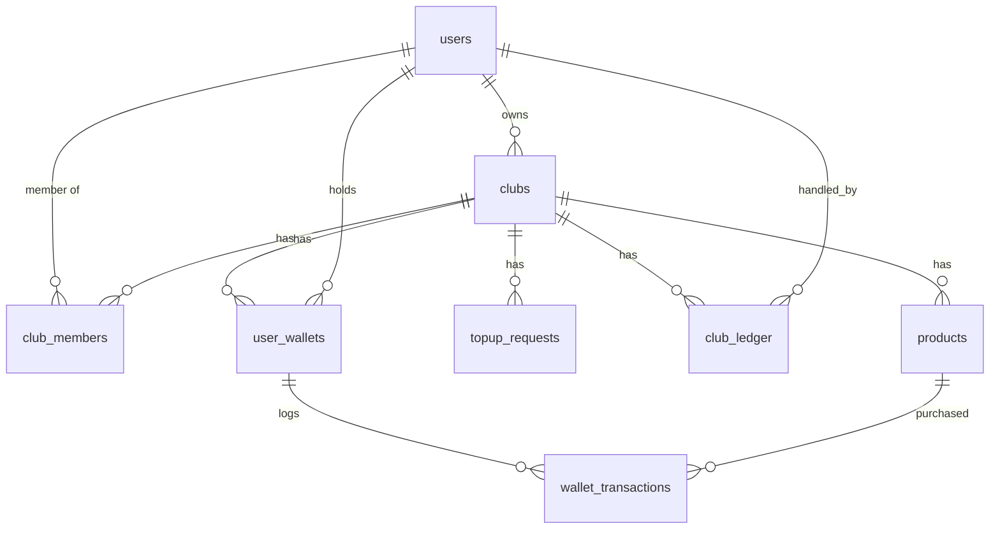

# 00 — Master Execution Plan
**Club CRM · Financial/Behavioral Platform**  
**Audience:** Autonomous sub-agents (Backend DB → Backend Logic → Frontend)  
**Status:** Definitive — supersedes ambiguities in docs 01–06 with stack answers below.

---

## 0. Definitive Stack & Hosting Constraints

| Layer | Choice |
|-------|--------|
| Frontend | React 19 SPA, Vite, TanStack Router (file-based), static build served by web server |
| API | REST JSON only — **no GraphQL** |
| Backend | Headless Laravel API (`/backend`) |
| Database | MySQL (Hostinger) |
| Cache | `database` driver (no Redis/Memcached) |
| Session | `database` driver |
| Queue | `database` driver; cron `* * * * * php artisan queue:work --stop-when-empty` |
| Assets | `storage/app/public` + `php artisan storage:link` |
| AI | Kimi 2.6 via Canopywave — **Laravel proxy only**, 3s timeout, silent fallback |

### Identity / Onboarding (definitive)
- **No public self-registration.** Admin creates users (email) from dashboard; assigns `nfc_uid` in `club_members`. Physical card delivered manually.
- **First NFC scan** → Setup PIN screen directly (no email prompt).
- Admin uses same NFC+PIN flow; frontend shows **"Go to Admin Dashboard"** toggle when JWT payload indicates `user_id === clubs.owner_id`.
- **DB constraint:** `UNIQUE(club_id, user_id)` — one card per user per club.

### NFC / PIN / JWT (definitive)
- Entry endpoint: `ThrottleRequests` + custom IP tracker — **10 failed attempts → IP blocked 5 min**.
- **5 consecutive wrong PINs per `nfc_uid` → 15 min lockout** (HTTP 429).
- JWT TTL **2 hours**, **no refresh token**. Frontend idle timeout **3 min** destroys token client-side only (no server invalidation).
- JWT stored in **`sessionStorage` only**; all API calls use `Authorization: Bearer`.
- `club_members.status` ENUM: **`active`, `suspended`** (NOT `paused`).

### Treasury / Wallet (definitive)
- `topup_requests`: pending/approved/rejected; rejected rows kept; `admin_note` nullable.
- `club_ledger` types: `user_topup`, `admin_injection`, `admin_expense`; add `handled_by` (nullable FK `users.id`).
- Pricing: `allow_fractions=false` → reject non-multiples of `step_value` (422); `allow_fractions=true` → pro-rata (`7/5*2.50=3.50`).
- `custom_text`: `price_config.flat_price`; text input is note only.
- **No refunds**; admin re-credits via `admin_injection`.
- Purchases: **`lockForUpdate()`** on `user_wallets` row inside DB transaction.

### AI (definitive)
- **Coach trigger:** cumulative user spend last 7 days **> €30**.
- Canopywave timeout **3 seconds**; on failure, proceed without AI block (silent fallback).

---

## 1. MySQL ER Schema (Definitive)

### 1.1 `users`
Global identity registry. No self-registration.

| Column | Type | Constraints |
|--------|------|-------------|
| `id` | `BIGINT UNSIGNED` | PK, AUTO_INCREMENT |
| `email` | `VARCHAR(255)` | NOT NULL, UNIQUE |
| `password_hash` | `VARCHAR(255)` | NULL (reserved; auth is NFC+PIN) |
| `created_at` | `TIMESTAMP` | |
| `updated_at` | `TIMESTAMP` | |

**Indexes:** `UNIQUE(email)`

---

### 1.2 `clubs`
Multi-tenant root entity.

| Column | Type | Constraints |
|--------|------|-------------|
| `id` | `BIGINT UNSIGNED` | PK, AUTO_INCREMENT |
| `owner_id` | `BIGINT UNSIGNED` | NOT NULL, FK → `users.id` RESTRICT |
| `name` | `VARCHAR(255)` | NOT NULL |
| `theme_config` | `JSON` | NOT NULL |
| `created_at` | `TIMESTAMP` | |
| `updated_at` | `TIMESTAMP` | |

**Indexes:** `INDEX(owner_id)`

---

### 1.3 `club_members`
Gatekeeper pivot — NFC + PIN session source.

| Column | Type | Constraints |
|--------|------|-------------|
| `id` | `BIGINT UNSIGNED` | PK, AUTO_INCREMENT |
| `club_id` | `BIGINT UNSIGNED` | NOT NULL, FK → `clubs.id` CASCADE |
| `user_id` | `BIGINT UNSIGNED` | NOT NULL, FK → `users.id` CASCADE |
| `nfc_uid` | `VARCHAR(64)` | NULL, UNIQUE (NULL when card revoked) |
| `pin_hash` | `VARCHAR(255)` | NULL (NULL forces PIN setup) |
| `status` | `ENUM('active','suspended')` | NOT NULL, DEFAULT `'active'` |
| `failed_pin_attempts` | `TINYINT UNSIGNED` | NOT NULL, DEFAULT 0 |
| `pin_locked_until` | `TIMESTAMP` | NULL |
| `created_at` | `TIMESTAMP` | |
| `updated_at` | `TIMESTAMP` | |

**Indexes:**
- `UNIQUE(club_id, user_id)` — one card per user per club
- `UNIQUE(nfc_uid)` — global physical card identity
- `INDEX(club_id)`, `INDEX(user_id)`

---

### 1.4 `user_wallets`
Virtual credit balance (not withdrawable cash).

| Column | Type | Constraints |
|--------|------|-------------|
| `id` | `BIGINT UNSIGNED` | PK, AUTO_INCREMENT |
| `club_id` | `BIGINT UNSIGNED` | NOT NULL, FK → `clubs.id` CASCADE |
| `user_id` | `BIGINT UNSIGNED` | NOT NULL, FK → `users.id` CASCADE |
| `current_balance` | `DECIMAL(10,2)` | NOT NULL, DEFAULT 0.00 |
| `created_at` | `TIMESTAMP` | |
| `updated_at` | `TIMESTAMP` | |

**Indexes:** `UNIQUE(club_id, user_id)`

---

### 1.5 `topup_requests`
User-initiated wallet recharge requests.

| Column | Type | Constraints |
|--------|------|-------------|
| `id` | `BIGINT UNSIGNED` | PK, AUTO_INCREMENT |
| `club_id` | `BIGINT UNSIGNED` | NOT NULL, FK → `clubs.id` CASCADE |
| `user_id` | `BIGINT UNSIGNED` | NOT NULL, FK → `users.id` CASCADE |
| `amount` | `DECIMAL(10,2)` | NOT NULL, CHECK amount > 0 |
| `status` | `ENUM('pending','approved','rejected')` | NOT NULL, DEFAULT `'pending'` |
| `admin_note` | `TEXT` | NULL |
| `created_at` | `TIMESTAMP` | |
| `updated_at` | `TIMESTAMP` | |

**Indexes:** `INDEX(club_id, status)`, `INDEX(user_id)`

---

### 1.6 `club_ledger`
Real-world cash flow registry (Treasury). Purchases do **not** touch this table.

| Column | Type | Constraints |
|--------|------|-------------|
| `id` | `BIGINT UNSIGNED` | PK, AUTO_INCREMENT |
| `club_id` | `BIGINT UNSIGNED` | NOT NULL, FK → `clubs.id` CASCADE |
| `transaction_type` | `ENUM('user_topup','admin_injection','admin_expense')` | NOT NULL |
| `amount` | `DECIMAL(10,2)` | NOT NULL (+ inflow, − expense) |
| `description` | `TEXT` | NOT NULL |
| `handled_by` | `BIGINT UNSIGNED` | NULL, FK → `users.id` SET NULL |
| `created_at` | `TIMESTAMP` | |
| `updated_at` | `TIMESTAMP` | |

**Indexes:** `INDEX(club_id, created_at)`, `INDEX(handled_by)`

---

### 1.7 `products`
Dynamic catalog with JSON pricing.

| Column | Type | Constraints |
|--------|------|-------------|
| `id` | `BIGINT UNSIGNED` | PK, AUTO_INCREMENT |
| `club_id` | `BIGINT UNSIGNED` | NOT NULL, FK → `clubs.id` CASCADE |
| `name` | `VARCHAR(255)` | NOT NULL |
| `selling_mode` | `ENUM('unit','weight','volume','custom_text')` | NOT NULL |
| `price_config` | `JSON` | NOT NULL |
| `is_active` | `BOOLEAN` | NOT NULL, DEFAULT TRUE |
| `created_at` | `TIMESTAMP` | |
| `updated_at` | `TIMESTAMP` | |

**Indexes:** `INDEX(club_id, is_active)`

#### `price_config` JSON schemas

```json
// unit | weight | volume
{
  "step_value": 5,
  "unit_label": "grams",
  "price_per_step": 2.50,
  "allow_fractions": true
}

// custom_text
{
  "flat_price": 15.00,
  "unit_label": "request"
}
```

---

### 1.8 `wallet_transactions`
Internal purchase log (credit consumption).

| Column | Type | Constraints |
|--------|------|-------------|
| `id` | `BIGINT UNSIGNED` | PK, AUTO_INCREMENT |
| `wallet_id` | `BIGINT UNSIGNED` | NOT NULL, FK → `user_wallets.id` CASCADE |
| `product_id` | `BIGINT UNSIGNED` | NOT NULL, FK → `products.id` RESTRICT |
| `amount_deducted` | `DECIMAL(10,2)` | NOT NULL |
| `metadata` | `JSON` | NOT NULL — quantity, unit_label, custom_text note |
| `created_at` | `TIMESTAMP` | NOT NULL |

**Indexes:** `INDEX(wallet_id, created_at)`, `INDEX(product_id)`

---

### 1.9 `ip_auth_blocks`
IP-level brute-force protection for entry/auth endpoints.

| Column | Type | Constraints |
|--------|------|-------------|
| `id` | `BIGINT UNSIGNED` | PK, AUTO_INCREMENT |
| `ip_address` | `VARCHAR(45)` | NOT NULL, UNIQUE |
| `failed_attempts` | `SMALLINT UNSIGNED` | NOT NULL, DEFAULT 0 |
| `blocked_until` | `TIMESTAMP` | NULL |
| `updated_at` | `TIMESTAMP` | |

---

### 1.10 Laravel infrastructure tables (Hostinger)
Already scaffolded by Laravel; configure drivers in `.env`:

| Table | Driver |
|-------|--------|
| `cache` / `cache_locks` | `CACHE_STORE=database` |
| `sessions` | `SESSION_DRIVER=database` |
| `jobs` / `job_batches` / `failed_jobs` | `QUEUE_CONNECTION=database` |

---

### 1.11 ER Diagram (Mermaid)



---

## 2. Complete REST API Mapping

**Base URL:** `/api`  
**Auth header:** `Authorization: Bearer <jwt>` (except public entry/auth routes)  
**JWT claims:** `sub` (user_id), `club_id`, `club_member_id`, `is_club_owner` (bool), `exp` (2h)

### 2.1 Middleware Stack

| Middleware | Routes | Behavior |
|------------|--------|----------|
| `throttle:entry` | Entry + auth | 60/min + `IpAuthBlockMiddleware` (10 fails → 5 min block) |
| `jwt.auth` | All protected | Validate JWT; attach `user`, `club_id` to request |
| `club.scope` | Club-scoped | Reject if route `:club_id` ≠ JWT `club_id` → 403 |
| `club.member.active` | Auth + protected | Reject `suspended` → 403 |
| `club.admin` | Admin routes | Require `is_club_owner` → 403 |

### 2.2 Public — Entry & Auth

#### `GET /api/entry/{club_id}/{nfc_uid}`
Resolve NFC card state before PIN UI.

**Middleware:** `throttle:entry`

**Response 200:**
```json
{
  "club_id": 1,
  "nfc_uid": "ABC123",
  "requires_pin_setup": true,
  "club_name": "The Velvet Room",
  "theme_config": { "template_id": 3, "colors": {} }
}
```

**Errors:** 404 (unknown card), 403 (suspended), 429 (IP or PIN lockout)

---

#### `POST /api/auth/pin-setup`
First-time PIN assignment.

**Body:** `{ "club_id": 1, "nfc_uid": "ABC123", "pin": "123456" }`

**Validation:** PIN exactly 6 digits; `pin_hash` must be NULL; member `active`.

**Response 200:** Same as login (JWT + profile).

---

#### `POST /api/auth/login`
Standard NFC+PIN authentication.

**Body:** `{ "club_id": 1, "nfc_uid": "ABC123", "pin": "123456" }`

**Logic:**
1. Check `pin_locked_until` → 429 if active.
2. Verify bcrypt/argon2 hash.
3. On failure: increment `failed_pin_attempts`; at 5 → set `pin_locked_until = now()+15min`, 429.
4. On success: reset `failed_pin_attempts`, issue JWT (2h).

**Response 200:**
```json
{
  "token": "eyJ...",
  "expires_in": 7200,
  "user": { "id": 1, "email": "member@club.test" },
  "club": { "id": 1, "name": "The Velvet Room", "theme_config": {} },
  "is_club_owner": false
}
```

**Errors:** 401 (wrong PIN), 403 (suspended), 429 (lockout/IP block)

---

### 2.3 User — Wallet & Catalog

#### `GET /api/clubs/{club_id}/wallet`
**Middleware:** `jwt.auth`, `club.scope`

**Response 200:**
```json
{ "current_balance": "47.50", "club_id": 1 }
```

---

#### `POST /api/clubs/{club_id}/wallet/topup-requests`
**Body:** `{ "amount": "50.00" }`

**Response 201:**
```json
{ "id": 12, "amount": "50.00", "status": "pending", "created_at": "..." }
```

---

#### `GET /api/clubs/{club_id}/wallet/topup-requests`
List own requests (paginated).

---

#### `GET /api/clubs/{club_id}/products`
Active products for club.

**Response 200:**
```json
{
  "data": [
    {
      "id": 3,
      "name": "Premium Pack",
      "selling_mode": "unit",
      "price_config": { "step_value": 1, "unit_label": "pack", "price_per_step": 20.00, "allow_fractions": false }
    }
  ]
}
```

---

### 2.4 User — Purchases

#### `POST /api/clubs/{club_id}/purchases`
**Body:**
```json
{
  "product_id": 3,
  "quantity": 10,
  "custom_note": "Optional for custom_text"
}
```

**Server logic:**
1. Load product; compute price (422 if fraction rules violated).
2. `DB::transaction`: `lockForUpdate()` wallet → check balance → decrement → insert `wallet_transactions`.
3. **Do not** write `club_ledger`.

**Response 200:**
```json
{
  "transaction_id": 88,
  "amount_deducted": "5.00",
  "new_balance": "42.50"
}
```

**Errors:** 402 (insufficient balance), 422 (invalid quantity/pricing)

---

### 2.5 AI Proxy

#### `POST /api/clubs/{club_id}/ai/intervene`
Pre-purchase Coach friction.

**Body:** `{ "product_id": 3, "quantity": 2, "custom_note": null }`

**Logic:**
1. Compute intended cost.
2. If 7-day cumulative spend ≤ €30 → return `{ "intervention_required": false }`.
3. Else call Canopywave (3s timeout). On timeout/error → `{ "intervention_required": false }` (silent fallback).
4. On success → `{ "intervention_required": true, "message": "...", "persona": "coach" }`

---

#### `POST /api/clubs/{club_id}/ai/chat`
Sommelier / general chat.

**Body:** `{ "message": "What pairs well with...", "product_id": 3 }`

**Response 200:** `{ "message": "...", "persona": "sommelier" }`

---

### 2.6 Admin — Members

#### `POST /api/clubs/{club_id}/admin/members`
Create user + membership + wallet.

**Body:** `{ "email": "new@club.test", "nfc_uid": "XYZ789" }`

**Logic:** Create `users` row if email new; insert `club_members`, `user_wallets` (balance 0).

---

#### `GET /api/clubs/{club_id}/admin/members`
List all members with wallet balance, status, nfc_uid.

---

#### `PATCH /api/clubs/{club_id}/admin/members/{member_id}/reset-pin`
Sets `pin_hash = NULL`, resets lockout counters.

---

#### `PATCH /api/clubs/{club_id}/admin/members/{member_id}/suspend`
Toggle or set `status = suspended`.

---

#### `PATCH /api/clubs/{club_id}/admin/members/{member_id}/revoke-card`
Sets `nfc_uid = NULL`.

---

### 2.7 Admin — Treasury

#### `GET /api/clubs/{club_id}/admin/treasury`
**Response:**
```json
{
  "cash_flow_total": "1250.00",
  "ledger": [{ "id": 1, "transaction_type": "user_topup", "amount": "50.00", "description": "...", "created_at": "..." }]
}
```

---

#### `GET /api/clubs/{club_id}/admin/topup-requests?status=pending`
---

#### `POST /api/clubs/{club_id}/admin/topup-requests/{id}/approve`
**DB transaction:** status→approved; wallet+=amount; ledger `user_topup` +amount; `handled_by` = admin.

---

#### `POST /api/clubs/{club_id}/admin/topup-requests/{id}/reject`
**Body:** `{ "admin_note": "Insufficient proof of payment" }`  
Status→rejected; record kept.

---

#### `POST /api/clubs/{club_id}/admin/treasury/injection`
Direct wallet credit (bypass request).

**Body:** `{ "user_id": 2, "amount": "30.00", "description": "Manual correction" }`

**DB transaction:** wallet+=amount; ledger `admin_injection` +amount.

---

#### `POST /api/clubs/{club_id}/admin/treasury/expense`
**Body:** `{ "amount": "120.00", "description": "Wholesale stock" }`

Insert ledger `admin_expense` with **negative** amount.

---

#### `POST /api/clubs/{club_id}/admin/products` / `PATCH` / `DELETE`
CRUD for product catalog (admin only).

---

## 3. React/Vite Component Tree & Theme Provider

```
src/
├── main.tsx                    # Vite entry, RouterProvider
├── App.tsx
├── router/
│   ├── index.tsx               # TanStack Router root
│   └── routes/
│       ├── entry.$clubId.$nfcUid.tsx   # NFC landing → PIN or Setup
│       ├── club.$clubId/
│       │   ├── _authenticated.tsx      # JWT guard layout
│       │   ├── index.tsx               # Product catalog
│       │   ├── wallet.tsx
│       │   ├── purchase.$productId.tsx
│       │   └── admin/
│       │       ├── index.tsx           # Treasury dashboard
│       │       ├── members.tsx
│       │       ├── topups.tsx
│       │       └── products.tsx
│       └── locked.tsx                  # Idle timeout lock screen
├── providers/
│   ├── ThemeProvider.tsx       # CSS variable injection
│   ├── AuthProvider.tsx        # sessionStorage JWT, idle timer
│   └── ClubProvider.tsx        # club_id scope from JWT
├── components/
│   ├── layout/
│   │   ├── LayoutResolver.tsx  # template_id → dynamic layout
│   │   ├── templates/        # Template1..6
│   │   └── AdminToggle.tsx     # visible if is_club_owner
│   ├── auth/
│   │   ├── PinNumpad.tsx
│   │   └── PinSetup.tsx
│   ├── wallet/
│   │   ├── BalanceCounter.tsx  # animated roll
│   │   └── TopupRequestForm.tsx
│   ├── products/
│   │   ├── ProductCard.tsx
│   │   ├── UnitStepper.tsx
│   │   ├── WeightSlider.tsx
│   │   ├── CustomTextInput.tsx
│   │   └── PricePreview.tsx
│   ├── purchase/
│   │   ├── ConfirmModal.tsx    # glassmorphism
│   │   ├── AiFrictionModal.tsx
│   │   └── SuccessAnimation.tsx
│   └── admin/
│       ├── TreasurySummary.tsx
│       ├── LedgerTable.tsx
│       └── MemberManager.tsx
├── hooks/
│   ├── useAuth.ts
│   ├── useIdleTimeout.ts       # 3 min → clear sessionStorage
│   ├── useTheme.ts
│   └── useApi.ts               # Bearer injection
├── lib/
│   ├── api.ts                  # fetch wrapper
│   ├── pricing.ts              # mirror backend pro-rata rules
│   └── storage.ts              # sessionStorage JWT helpers
└── styles/
    ├── index.css               # Tailwind + CSS variables
    └── themes.css
```

### Theme Provider injection logic

```typescript
// On login/entry success:
function applyTheme(themeConfig: ThemeConfig) {
  const root = document.documentElement;
  root.style.setProperty('--color-primary', themeConfig.colors.primary);
  root.style.setProperty('--color-secondary', themeConfig.colors.secondary);
  root.style.setProperty('--color-background', themeConfig.colors.background);
  root.style.setProperty('--glass-opacity', String(themeConfig.colors.glass_opacity));
  root.style.setProperty('--font-heading', themeConfig.typography.heading_font);
  root.style.setProperty('--font-body', themeConfig.typography.body_font);
  // LayoutResolver reads themeConfig.template_id
}
```

Tailwind config maps utilities to `var(--color-primary)` etc.

---

## 4. Step-by-Step Roadmap for Sub-Agents

### Phase 1 — Backend DB ✅ (current)
**Agent: Backend DB**
1. Initialize Laravel in `/backend`
2. Migrations: all domain tables + modify `users`
3. Eloquent models + relationships
4. Seeders: demo club, owner, members, products
5. Verify: `php artisan migrate:fresh --seed`

### Phase 2 — Backend Core Logic
**Agent: Backend Auth**
1. Install `firebase/php-jwt` (or `tymon/jwt-auth`)
2. `IpAuthBlockMiddleware`, PIN lockout service
3. Entry, pin-setup, login controllers
4. JWT middleware + club scope middleware

**Agent: Backend Treasury**
1. Topup request service (approve/reject/inject)
2. Ledger service (expense logging)
3. Purchase service with `lockForUpdate()` + pricing validator
4. Admin member management (reset PIN, suspend, revoke)

**Agent: Backend AI**
1. `CanopywaveClient` with 3s timeout
2. RAG context builder (balance, last 10 transactions, theme)
3. `/ai/intervene` Coach trigger (7-day €30 threshold)
4. `/ai/chat` Sommelier endpoint

**Agent: Backend Config**
1. `.env` Hostinger template (MySQL, database cache/session/queue)
2. CORS for SPA origin
3. `storage:link` + asset URL config
4. API route registration + exception handler (402, 429 shapes)

### Phase 3 — Frontend Scaffold
**Agent: Frontend Setup**
1. Vite + React 19 + TanStack Router + Tailwind
2. AuthProvider (sessionStorage JWT, 3 min idle)
3. API client with Bearer header
4. Entry route ` /entry/:clubId/:nfcUid`

### Phase 4 — Frontend Features
**Agent: Frontend Auth UI** → Pin numpad, setup, locked screen  
**Agent: Frontend Catalog** → Dynamic product inputs + price preview  
**Agent: Frontend Wallet** → Balance, topup requests  
**Agent: Frontend Purchase** → AI friction modal → confirm → animation  
**Agent: Frontend Admin** → Treasury, members, topup approval, products  
**Agent: Frontend Theme** → ThemeProvider, 6 layout templates, GSAP/Framer Motion

### Phase 5 — Integration & Deploy ✅
1. End-to-end purchase + treasury flow tests
2. Hostinger deploy: MySQL migrate, cron queue worker, static SPA + API subdomain
3. NFC URL production config

---

## 5. Pricing Algorithm (Shared Backend/Frontend)

```php
function calculatePrice(array $priceConfig, string $sellingMode, float $quantity): float
{
    if ($sellingMode === 'custom_text') {
        return (float) $priceConfig['flat_price'];
    }
    $step = (float) $priceConfig['step_value'];
    $pricePerStep = (float) $priceConfig['price_per_step'];
    $allowFractions = (bool) ($priceConfig['allow_fractions'] ?? false);

    if (!$allowFractions && fmod($quantity, $step) != 0.0) {
        throw new InvalidQuantityException();
    }
    return ($quantity / $step) * $pricePerStep;
}
```

---

## 6. Non-Negotiable Business Rules Checklist

- [x] No carts, checkout, refunds, or withdrawals
- [x] Purchases never write `club_ledger`
- [x] Top-ups / injections always write `club_ledger` (+) and wallet (+)
- [x] Admin consumes via same wallet friction as members
- [x] JWT club_id scope enforced on every mutating route
- [x] AI never called from frontend directly
- [x] Coach silent fallback on Canopywave failure
- [x] Pessimistic wallet lock on every purchase

---

*Document generated from specs 01–06 + definitive stack answers. Sub-agents must treat this file as source of truth.*
